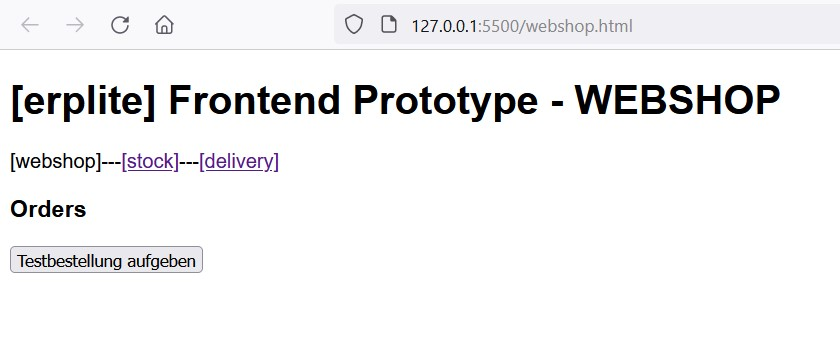
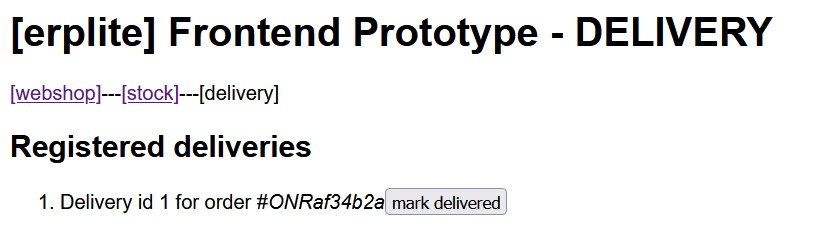

# FSE_Landerer_Makroarchitektur_Teil3

# Aufgabe Makroarchitektur Teil 3
## Inbetriebnahme der Microservice-Variante von erplite als Schritt für Schritt-Anleitung mit Screenshots und Text zu dokumentieren

Um die Microservice-Variante von erplite in Betrieb nehmen zu können, müssen folgende Schritte durchgeführt werden:


- herunterladen der Docker-Container und das Starten dieser Container


- alle Microservices werden in ein IntelliJ Projekt geladen


- nun werden die einzelnen Microservices gestartet - dabei muss auf die Reihenfolge geachtet werden


- zunächst muss das Microservice 'ServiceDiscovery' gestartet werden


- danach können die Microservices 'DeliverMS', 'OrderMS' und 'StockMS' gestartet werden - hierbei ist die Reihenfolge nicht wichtig


- zuletzt wird das Microservice 'ApiGateway' gestartet


- nun können die Files für das Frontend in VS-Code geöffnet werden - über 'Go Live' kann die Anwendung über '127.0.0.1:5500' gestartet werden



- das Frontend zeigt einen einfachen Webshop, in dem ein einfacher Workflow durchgespielt wird


- beim klick auf den Button 'Testbestellung aufgeben' wird eine neue Bestellung abgesetzt


- eine neue Bestellung mit dem Status 'PLACED' ist nun im System


- beim klick auf den Button 'payment received' wird der Status der Bestellung auf 'PAYMENT_VERIFIED' gesetzt...


- ...gleichzeitig landen die Artikel im Stock, um 'verpackt' zu werden


- klickt man bei den Artikeln jeweils auf 'mark packed' wird der Status der Artikel auf 'PACKED' gesetzt 


- der jeweilige Pack-Status wird im Stock angezeigt


- ist jeder Artikel der Bestellung auf 'PACKED', wird die ganze Bestellung auf 'PREPARING_FOR_DELIVERY' gesetzt


- klickt man im Webshop nun auf den Button 'request delivery', wird die Lieferung der Bestellung veranlasst


- der Status der Bestellung lautet nun 'IN_DELIVERY'



- in Delivery werden die Bestellungen, die versendet wurden, angezeigt


- beim klick auf den Button 'mark delivery' kann für jede Bestellung angegeben werden, dass sie geliefert wurde - der Status der Lieferung wird dann auf 'delivered' geändert


- auch der Status der Bestellung ist nun auf 'DELIVERED'

## Abgabe einer Architekturanalyse des bestehenden erplitems-Backends
### Schriftliche Dokumentation der Architektur als C4-Containerdiagramm und C4-Componentendiagramm incl. textuellen Beschreibungen, Codeauszügen und Screenshots.

Die folgenden Diagramme zeigen den Aufbau des Systems.

**ErpliteApplication C4Context-Diagramm:**

Das Diagramm stellt den Kontext der ErpliteApplication-Plattform dar. Es besteht aus den folgenden Komponenten:

1. User:
Ein Benutzer, der das Frontend der Anwendung nutzt.

2. Frontend:
Das Frontend der Anwendung, das dem Benutzer die Schnittstelle zur Interaktion mit der ErpliteApplication-Plattform bietet.

3. ErpliteApplication:
Das Kernsystem der ErpliteApplication-Plattform, das die Verwaltung von Bestellungen ermöglicht. Es beinhaltet die zentralen Funktionen und die Geschäftslogik für die Bestellverarbeitung.

4. Docker Container (Host):
Der Docker Container, der das ErpliteApplication-System hostet und die erforderliche Infrastruktur zur Verfügung stellt, um das System auszuführen.

Die Beziehungen im Diagramm zeigen die Interaktionen zwischen den Komponenten auf:

- Der Benutzer nutzt das Frontend der Anwendung, um mit der ErpliteApplication-Plattform zu interagieren.
- Das Frontend verwendet das ErpliteApplication-System, um Bestellungen zu verwalten.
- Das ErpliteApplication-System ist auf dem Docker Container gehostet und nutzt die dort bereitgestellte Funktionalität für den Betrieb.
- Das C4Context-Diagramm bietet einen Überblick über die Komponenten und deren Beziehungen im Kontext der ErpliteApplication-Plattform. Es hilft dabei, das Verständnis der Systemumgebung und der wichtigsten Akteure zu vermitteln.


**ErpliteApplication C4Container-Diagramm:**

Das Diagramm zeigt die Containerstruktur der ErpliteApplication-Plattform und deren Interaktionen:

1. User: Ein Benutzer, der das Frontend der Anwendung verwendet, um mit der Plattform zu interagieren.

2. Frontend: Das Frontend der Anwendung, das in Vanilla JavaScript entwickelt wurde. Es besteht aus drei Seiten (Webshop, Stock, Delivery), die über das API-Gateway auf die Backend-Microservices zugreifen.

3. API-Gateway: Ein Spring Boot-Container mit Spring Cloud Gateway. Es routet eingehende Anfragen auf die entsprechenden Microservices weiter und bietet zusätzliche Funktionalitäten wie Authentifizierung, Lastenausgleich, Fehlertoleranz und Wiederholungen.

4. DeliveryMS: Ein Spring Boot-Container ohne explizite Architektur, der die Logik im Zusammenhang mit Bestellungen verwaltet.

5. OrdersMS: Ein Spring Boot-Container, der nach der Ports and Adapters-Architektur mit einigen taktischen DDD-Mustern entwickelt wurde. Er verwaltet die Logik im Zusammenhang mit dem Lager.

6. StockMS: Ein Spring Boot-Container ohne explizite Architektur, der Funktionen für die Hauptmodule bereitstellt.

7. Service Discovery: Ein Spring Boot-Container mit Netflix Eureka, der die Registrierung der Microservices ermöglicht und über das API-Gateway den Zugriff auf die Microservices per Namen bereitstellt.

8. Docker Container (Host): Die Docker Container-Systemumgebung, die die ErpliteApplication-Plattform hostet und die erforderliche Infrastruktur bereitstellt.

9. MariaDB: Ein Container für die MariaDB-Datenbank, der die Inhalte der Anwendung sowie Informationen zu Kunden, Bestellungen und Lagerbeständen in drei separaten Datenbanken speichert.

10. PHPMyAdmin und Adminer: Container-basierte Werkzeuge zur Verwaltung der Datenbanken.

11. RabbitMQ: Ein Message Broker für die Kommunikation zwischen den Spring-Boot-Services in der Plattform.

Die Beziehungen im Diagramm zeigen die Interaktionen zwischen den Containern auf:

- PHPMyAdmin und Adminer verwalten die Datenbank.
- Der RabbitMQ-Message-Broker regelt die Kommunikation zwischen den Spring-Boot-Services DeliverMS, OrderMS und StockMS.
- Der Benutzer (user) verwendet das Frontend, das HTTP-Anfragen an das API-Gateway sendet.
- Das Frontend nutzt das API-Gateway, um HTTP-Anfragen an die Microservices weiterzuleiten.
- Der DeliverMS, OrderMS und StockMS registrieren sich beim Service Discovery.
- Der DeliverMS, OrderMS und StockMS lesen und schreiben Daten in der Datenbank.
- Das API-Gateway leitet HTTP-Anfragen an den OrderMS, DeliverMS und StockMS weiter.
- Das API-Gateway fordert IP-Adressen und Ports von der Service Discovery an.
- Diese Beschreibung gibt einen genauen Überblick über die Beziehungen zwischen den einzelnen Containern - und deren Interaktionen im PlantUML Container-Diagramm.


**Ordermanagement C4Component-Diagramm:**

Das Diagramm zeigt die Komponentenstruktur des Ordermanagementsystems und deren Interaktionen:

1. API-Gateway: Ein Spring Boot-Container mit Spring Cloud Gateway. Das API-Gateway routet eingehende Anfragen auf die entsprechenden Microservices weiter und bietet zusätzliche Funktionalitäten wie Authentifizierung, Lastenausgleich, Fehlertoleranz und Wiederholungen.

2. Service Discovery: Ein Spring Boot-Container mit Netflix Eureka, der die Registrierung der Microservices ermöglicht und über das API-Gateway den Zugriff auf die Microservices per Namen bereitstellt.

3. Ordermanagement: Der Container, der das Ordermanagementsystem umfasst.

Innerhalb des Ordermanagement-Containers gibt es folgende Komponenten:

1. Order REST-Controller (orc): Ein REST-Controller, der eine Schnittstelle bereitstellt, über die Bestellungen abgerufen und bearbeitet werden können. Er empfängt HTTP-Anfragen vom Frontend über das API-Gateway.

2. Order Command Service (ocs): Eine Komponente für die Geschäftslogik im Zusammenhang mit Bestellungen. Sie verarbeitet Befehle wie das Platzieren von Bestellungen und die Überprüfung der Zahlung.

3. Order Query Service (oqs): Eine Komponente für die Abfrage von Bestelldaten. Sie bietet Abfragemöglichkeiten, um Bestelldaten basierend auf bestimmten Kriterien abzurufen.

4. Order Repository (or): Eine Komponente für den Datenzugriff auf Bestellungen in der Datenbank. Sie stellt eine Schnittstelle zum Lesen, Schreiben und Aktualisieren von Bestelldaten bereit.

5. Order Outgoing Message Relay (oomr): Eine Komponente für das Messaging-Interface, das das Veröffentlichen von ausgehenden Bestellereignissen ermöglicht, wie z.B. das Platzieren einer Bestellung, die Validierung der Zahlung und die Initiierung der Lieferung. Es ermöglicht die Kommunikation mit anderen Komponenten und Systemen.

6. Frontend: Das Frontend der Anwendung, das in Vanilla JavaScript entwickelt wurde. Es besteht aus drei Seiten (Webshop, Stock, Delivery), die über das API-Gateway auf die Backend-Microservices zugreifen.

7. MariaDB: Eine Container-Datenbank (MariaDB), die die Inhalte der Applikation sowie Informationen zu Kunden, Bestellungen und Lagerware in drei unterschiedlichen Datenbanken speichert.

8. RabbitMQ: Ein Message-Broker (RabbitMQ), der für die Kommunikation zwischen den Spring-Boot-Services verwendet wird.

Die Beziehungen im Diagramm zeigen die Interaktionen zwischen den Komponenten auf:

- Das Frontend sendet HTTP-Anfragen an das API-Gateway.
- Das API-Gateway leitet die HTTP-Anfragen an den Order REST-Controller (orc) weiter.
- Der Order REST-Controller (orc) nutzt den Order Command Service (ocs) und den Order Query Service (oqs) für die Geschäftslogik und Datenabfragen.
- Der Order Command Service (ocs) und der Order Query Service (oqs) nutzen das Order Repository (or) für den Datenzugriff.
- Das Order Repository (or) liest und schreibt Daten in die Datenbank.
- Der Order Command Service (ocs) nutzt das Order Outgoing Message Relay (oomr) für das Versenden von Nachrichten.
- Das Order Outgoing Message Relay (oomr) sendet Nachrichten über den RabbitMQ Message Broker.
- Das Component-Diagramm bietet einen Überblick über die Komponentenstruktur und die Interaktionen im Ordermanagementsystem.


Das **Orders MS** wurde nach der **Ports-And-Adapters-Architektur** aufgebaut (Ports in Grün und Adapters in Gelb). 


Außerdem wurden dort einige taktische Muster aus dem **Domain-driven Design (DDD)** eingesetzt, darunter:

* ValueObjects


* Aggregates

````java
//Order.java
@Getter
@ToString
@AggregateMarker
public final class Order {

    //ID
    private final OrderID orderID;

    //Customer-Data
    private CustomerData customerData;

    //Line-Items
    private final List<LineItem> lineItems;

    //Order-State and calcuated values
    private OrderState state;
    private final MonetaryAmount taxTotal;
    private final MonetaryAmount netTotal;
    private final MonetaryAmount grossTotal;
    private final LocalDateTime date;

    public Order(OrderID orderID, CustomerData customerData,
                 LocalDateTime date, List<LineItem> lineItems, OrderState status) {
        if (orderID == null) throw new IllegalArgumentException("orderID must not be null!");
        this.orderID = orderID;
        if (customerData == null)
            throw new IllegalArgumentException("Customer-Data for order invalid!");
        this.customerData = customerData;
        if (lineItems == null)
            throw new IllegalArgumentException("LineItems-List must not be null, at least an empy List is needed!");
        this.lineItems = lineItems;
        if (status == null) throw new IllegalArgumentException("State must not be null!");
        this.state = status;
        this.taxTotal = this.calculateOrderTax();
        this.netTotal = this.calculateOrderNetTotal();
        this.grossTotal = this.calculateOrderGrossTotal();
        this.date = date;
    }

    public List<LineItem> getLineItems() {
        return Collections.unmodifiableList(this.lineItems);
    }

    public void orderStateTransitionTo(OrderState newState) {
        switch (newState) {
            case CANCELED -> {
                if (this.state == OrderState.IN_DELIVERY || this.state == OrderState.DELIVERED)
                    throw new OrderStateChangeNotPossibleException("Order in State " + this.state + " cannot be canceled");
                this.state = newState;
            }
            case PAYMENT_VERIFIED -> {
                if (this.state != OrderState.PLACED)
                    throw new OrderStateChangeNotPossibleException("Order must be in state PLACED for transition to PAYMENT VERIFIED!");
                this.state = newState;
            }
            case PREPARING_FOR_DELIVERY -> {
                if (this.state != OrderState.PAYMENT_VERIFIED)
                    throw new OrderStateChangeNotPossibleException("Order must be in state PAYMENT VERIFED for transition to PREPARING FOR DELIVERY!");
                this.state = newState;
            }
            case IN_DELIVERY -> {
                if (this.state != OrderState.PREPARING_FOR_DELIVERY)
                    throw new OrderStateChangeNotPossibleException("Order must be in state PREPARING FOR DELIVERY for transition to IN DELIVERY!");
                this.state = newState;
            }
            case DELIVERED -> {
                if (this.state != OrderState.IN_DELIVERY)
                    throw new OrderStateChangeNotPossibleException("Order must be in state IN DELIVERY for transition to DELIVERED!");
                this.state = newState;
            }
        }
    }

    private MonetaryAmount calculateOrderTax() {
        MonetaryAmount orderTax = new MonetaryAmount(new BigDecimal(0));
        for (LineItem lineItem : this.lineItems) {

            orderTax = orderTax.add(lineItem.getTotalTaxLine());
        }
        return orderTax;
    }

    private MonetaryAmount calculateOrderNetTotal() {
        MonetaryAmount orderNetSum = new MonetaryAmount(new BigDecimal(0));
        for (LineItem lineItem : this.lineItems) {
            orderNetSum = orderNetSum.add(lineItem.getTotalNetLine());
        }
        return orderNetSum;
    }

    private MonetaryAmount calculateOrderGrossTotal() {
        return this.netTotal.add(this.taxTotal);
    }

    @Override
    public boolean equals(Object o) {
        if (this == o) return true;
        if (!(o instanceof Order)) return false;

        Order order = (Order) o;

        return getOrderID().equals(order.getOrderID());
    }

    @Override
    public int hashCode() {
        return getOrderID().hashCode();
    }


}
````

* Repositories (auf Aggregat-Ebene)

````java
//OrderRepositpryImpl.java
@RepositoryMarker
@Repository
class OrderRepositoryImpl implements OrderRepository {

    @Autowired
    private OrderJPARepository orderJPARepository;

    @Override
    public Optional<Order> insert(Order order) {
        if (order == null) throw new IllegalArgumentException("Order to be inserted must not be null!");
        OrderDbEntity orderDbEntity = DbOrderMapperService.toOrm(order);
        OrderDbEntity insertedEntity = orderJPARepository.save(orderDbEntity);
        if (insertedEntity == null) return Optional.empty();
        return Optional.of(DbOrderMapperService.toDomain(insertedEntity));
    }

    @Override
    public Optional<Order> getById(OrderID id) {
        if (id == null) throw new IllegalArgumentException("orderID for Order to get from db must not be null!");
        Optional<OrderDbEntity> orderEntityOptional = this.orderJPARepository.findById(id.id());
        if (!orderEntityOptional.isPresent()) return Optional.empty();
        return Optional.of(DbOrderMapperService.toDomain(orderEntityOptional.get()));
    }

    @Override
    public List<Order> getAll() {
        List<OrderDbEntity> list = this.orderJPARepository.findAll();
        if (list == null) return Collections.emptyList();
        return list.stream().map(dbEntity -> DbOrderMapperService.toDomain(dbEntity)).toList();
    }

    @Override
    public void deleteById(OrderID id) {
        this.orderJPARepository.deleteById(id.id());
    }

    @Override
    public List<Order> getAllSortedAndPaged(int page, int pageSize, String sortedBy) {
        Pageable sortedAndPagedOrders = PageRequest.of(page, pageSize, Sort.by(sortedBy));
        Page<OrderDbEntity> resultPage = this.orderJPARepository.findAll(sortedAndPagedOrders);
        if (resultPage.isEmpty()) return Collections.emptyList();
        return resultPage.stream().map(dbEntity -> DbOrderMapperService.toDomain(dbEntity)).toList();
    }

    @Override
    public void updateOrderWithNewState(Order order) { //first read the order, then change the entity object, then persist the order with save-call (transaction management included)
        Optional<OrderDbEntity> optOrderDbEntity = this.orderJPARepository.findById(order.getOrderID().id());
        if (optOrderDbEntity.isPresent()) {
            OrderDbEntity orderDbEntity = optOrderDbEntity.get();
            orderDbEntity.setState(order.getState());//set state
            //further field could be updated if necessary (in further methods or in one Method containing all changes)
            this.orderJPARepository.save(orderDbEntity);
        }

    }
}
````

* Event-getriebene Kommunikation zwischen Aggregaten


Das **Stock MS** und das **Delivery MS** folgen im Kontrast zum Orders MS nur einer leichtgewichtigen Schichtung ohne explizite Architektur.


Das **API Gateway** stellt den Zugriff auf die MS-Infrastruktur bereit. Es routet eingehende Anfragen auf die entsprechenden Microservices weiter und kann weitere Funktionalitäten wie Authentifizierung, Load-Balancing, Circuit-Breaker oder Retries bereitstellen.

````yml
#application.yml
server:
  port: 9999
spring:
  application:
    name: apigateway
  cloud:
    gateway:
      discovery:
        locator:
          # Verwendung der Service-Discovery für das Ansprechen der Microservices
          enabled: true
          # Alle in der Service-Discovery regstrierten Services in Lower-Case ansprechen (Standardmäßig UPPERCASE)
          lower-case-service-id: true
      routes:
        - id: orders
          # lb bedeutet hier, dass der Load-Balancer für die Ermittlung der eigentlichen Route verwendet wird.
          # Dieser wiederum fragt an der Service-Registry nach dem korrekten Server und Port (siehe discovery-Zweig)
          # Eine Anfrage mit dem Pfad /api/v1/orders/** wird an das Service geschickt, das in der Service-Registry
          # mit dem Namen erpliteorders registriert ist (ServerIP:Port wird ersetzt, Rest wird übernommen).
          uri: lb://erpliteorders
          predicates:
            - Path=/api/v1/orders/**
          filters:
            # Falls ein Response-Location header (wie z.B. beim Erstellen einer Ressource über POST-Request) vom Backend-Service im Response-Header zurückkommt,
            # wird der Server:Port-Teil mit den Serverdaten des API-Gateways überschrieben.
            - RewriteLocationResponseHeader=AS_IN_REQUEST, Location, ,
        - id: stock
          uri: lb://erplitestock
          predicates:
            - Path=/stock/**
        - id: delivery
          uri: lb://erplitedelivery
          predicates:
            - Path=/delivery/**
      globalcors:
        #CORS-Konfiguration
        cors-configurations:
          '[/**]':
            # Folgende Server werden als Anfragequelle erlaubt
            allowedOrigins: "http://127.0.0.1:5500, http://localhost:5500"
            # Folgende Header in HTTP-Anfragen werden erlaubt
            allowedHeaders:
              - Accept
              # Dieser Header wird für API-POST-Requests benötigt (application/json)
              - Content-Type
            # Folgende Methoden in HTTP-Anfragen werden erlaubt
            allowedMethods:
              - GET
              - POST
              - PUT
              - DELETE
eureka:
  client:
    service-url:
      defaultZone: http://localhost:8761/eureka
    #API Gateway holt sich die Daten aus der Service Discovery
    fetch-registry: true
    #API registriert sich selbst nicht als Service in der Service Discovery
    register-with-eureka: false
  instance:
    prefer-ip-address: true
management:
  # Actuator-Endpoint Konfiguration
  endpoints:
    jmx:
      exposure:
        include:
          - health
          - info
    web:
      exposure:
        include:
          - health
          - info
````
In der "application.yml"-Datei handelt es sich um eine Konfigurationsdatei für eine Spring Boot-Anwendung mit dem Namen "apigateway". Die Datei enthält Konfigurationseinstellungen für den API-Gateway-Dienst, der als zentraler Einstiegspunkt für den Zugriff auf Microservices in der Anwendung dient.

Hier ist eine kurze Beschreibung der wichtigsten Teile der Konfiguration:

- server: Hier wird der Port (9999) festgelegt, auf dem der API-Gateway-Server läuft.

- spring: Diese Abschnitte enthalten Konfigurationseinstellungen für die Spring Boot-Anwendung, wie den Anwendungsnamen ("apigateway").

- spring.cloud.gateway: In diesem Abschnitt werden Konfigurationseinstellungen für das Spring Cloud Gateway-Modul definiert.

    - discovery: Hier wird die Service-Discovery aktiviert, um Microservices über deren Namen ansprechen zu können. Der API-Gateway-Dienst verwendet die registrierten Dienste in der Service-Registry, um die Anfragen an die entsprechenden Microservices weiterzuleiten.

    - routes: In diesem Abschnitt werden die Routen für die Weiterleitung von Anfragen an die verschiedenen Microservices definiert. Jede Route hat eine eindeutige ID und wird anhand von Prädikaten (z. B. dem Pfad der Anfrage) und Filtern (z. B. RewriteLocationResponseHeader) konfiguriert. Die Anfragen werden anhand des Load-Balancers an den richtigen Service weitergeleitet.

- eureka: In diesem Abschnitt werden die Konfigurationseinstellungen für den Eureka-Service-Client angegeben, der für die Kommunikation mit der Service-Registry zuständig ist. Hier wird die URL der Service-Registry (defaultZone) festgelegt.

- management: Dieser Abschnitt konfiguriert die Endpoints für die Verwaltung der Anwendung, z. B. die Health- und Info-Endpoints. Hier wird festgelegt, welche Endpoints öffentlich zugänglich sein sollen.

Die "application.yml"-Datei enthält somit die Konfiguration für den API-Gateway-Dienst, einschließlich der Weiterleitungsregeln für Anfragen an die Microservices und der Integration mit der Service-Registry.

Die **Service Discovery** registriert die Microservices wenn diese gestartet werden und stellt einen Zugriff auf diese per Namen aus dem API-Gateway heraus bereit. Der Zugriff auf die Microservices erfolgt dementsprechend nicht mehr über IP-Adressen und Ports, sondern ähnlich einem DNS-System über einfache Namen.

````java
@SpringBootApplication
@EnableEurekaServer //Hier wird der EurekaServer "aktiviert", der die Microservices registriert
public class ServiceDiscovery {

    public static void main(String[] args) {
        SpringApplication.run(ServiceDiscovery.class, args);
    }

}
````


Alle drei Microservices wurden registriert.

**Infrastruktur (Docker-Container)**
- Die Daten werden in einer Maria-DB gespeichert, wobei jedes MS seine eigene DB hat (aus Vereinfachungsgründen aktuell auf einem Server)
  - Das Orders MS benötigt eine Datenbank namens **ordermgmt**.
  - Das Stock MS benötigt eine Datenbank namens **stockmgmt**.
  - Das Delivery MS benötigt eine Datenbank namens **deliverymgmt**.
  - weitere DB-Config siehe _application.properties_
- Für die Verwaltung der DB steht PhpMyAdmin oder Adminer bereit.
- Die Kommunikation zwischen den Spring-Boot-Services erfolgt über den RabbitMQ Message Broker. Hier wurde soeben ein "Payment received" abgesendet:


**Rest-APIs**

Die Microservices bieten REST-Apis für verschiedene Aufgaben an. Diese APIs können über Swagger erkundet werden.

````java
//DeliveryRestController.java
@RestController
@RequestMapping("/delivery")
@AllArgsConstructor
public class DeliveryRestController {

    private OrderDeliveryRepository orderDeliveryRepository;
    private RabbitTemplate template;

    @GetMapping()
    public ResponseEntity<List<OrderDelivery>> getAllDeliveries()
    {
        return ResponseEntity.ok(orderDeliveryRepository.findAll());
    }

    @PostMapping("/orderdelivered/{orderid}")
    public ResponseEntity orderDelivered(@PathVariable String orderid) {
        Logger.getLogger(this.getClass().getName()).log(Level.INFO, "Handling order delivered api request ...");
        Optional<OrderDelivery> orderDeliveryOptional = orderDeliveryRepository.findByOrderID(orderid);

        if (!orderDeliveryOptional.isPresent()) {
            Logger.getLogger(this.getClass().getName()).log(Level.INFO, "Order with # " + orderid + " not present / not registered for delivery in delivery service!");
            return ResponseEntity.status(HttpStatus.BAD_REQUEST).body("Order with # " + orderid + " not present / not registered for delivery in delivery service!"); //nothing to do --> idempotency
        } else {
            OrderDelivery orderDelivery = orderDeliveryOptional.get();

            if (orderDelivery.getDelivered()) {
                Logger.getLogger(this.getClass().getName()).log(Level.INFO, "Order with # " + orderDelivery.getOrderID() + " already delivered!");
                return ResponseEntity.status(HttpStatus.BAD_REQUEST).body("Order already in dilvery state!"); //nothing to do --> idempotency
            } else {
                orderDelivery.setDelivered();
                orderDeliveryRepository.save(orderDelivery);
                Logger.getLogger(this.getClass().getName()).log(Level.INFO, "Order delivered. Saved to DB. Publishing order delivered RabbitMQ event for order# " + orderDelivery.getOrderID());
                this.template.convertAndSend("q.order_delivered", new OrderDeliveredEvent(orderDelivery.getOrderID()));
                Logger.getLogger(this.getClass().getName()).log(Level.INFO, "Order delivered RabbitMQ event for order# " + orderDelivery.getOrderID() + " published!");
                return ResponseEntity.status(HttpStatus.OK).body("Order with id " +orderDelivery.getOrderID() + " delivered!");
            }
        }
    }
}
````

````java
//OrderRestController.java
@RestController
@RequestMapping("/api/v1")
@AllArgsConstructor
class OrderRestController {

    private OrderCommandService orderCommandService;
    private OrderQueryService orderQueryService;

    @PostMapping("/orders")//TODO: Hier von /orders/ mit trailing slash gewechselt auf /orders
    public ResponseEntity placeNewOrder(@RequestBody @Valid PlaceOrderCommand placeOrderCommand, BindingResult bindingResult) {

        Logger.getLogger(this.getClass().getName()).log(Level.INFO, "Handling place new order api request ...");

        HashMap<String, String> errors = new HashMap<>();

        if (bindingResult.hasErrors()) {
            Logger.getLogger(this.getClass().getName()).log(Level.WARNING, "Errors in placeOrderCommand detected!");
            for (FieldError fieldError : bindingResult.getFieldErrors()) {
                errors.put(fieldError.getField(), fieldError.getDefaultMessage());
            }
            throw new OrderPlacedFieldValidationException("Validation errors for order placement!", errors);
        }

        OrderResponse orderResponse = orderCommandService.handle(placeOrderCommand);

        String resourceLocation = ServletUriComponentsBuilder.fromCurrentContextPath().build().toUriString() + "/api/v1/orders/" + orderResponse.orderID();
        try {
            return ResponseEntity.created(new URI(resourceLocation)).body(orderResponse);
        } catch (URISyntaxException e) {
            return ResponseEntity.noContent().build();
        }
    }

    @GetMapping("/orders")//TODO: Hier von /orders/ mit trailing slash gewechselt auf /orders
    public ResponseEntity<List<OrderResponse>> getAllOrders() {
        Logger.getLogger(this.getClass().getName()).log(Level.INFO, "Handling get all orders api request ...");
        return ResponseEntity.ok().body(this.orderQueryService.getAllOrders());
    }

    @GetMapping("/orders/sortedandpaged/")
    public ResponseEntity<List<OrderResponse>> getAllOrdersSortedAndPaged(

            @RequestParam Optional<Integer> page,
            @RequestParam Optional<Integer> pagesize,
            @RequestParam Optional<String> sortedby) {

        Logger.getLogger(this.getClass().getName()).log(Level.INFO, "Handling getAllOrdersSortedAndPaged api request ...");

        if (page.isPresent() && pagesize.isPresent() && sortedby.isPresent()) {
            return ResponseEntity.ok().body(this.orderQueryService.handle(new GetAllOrdersSortedAndPagedQuery(page.get(), pagesize.get(), sortedby.get())));
        } else {
            return ResponseEntity.ok().body(this.orderQueryService.handle(new GetAllOrdersSortedAndPagedQuery(0, 10, "orderID")));
        }
    }

    @GetMapping("/orders/{orderid}")
    public ResponseEntity<OrderResponse> getOrderWithId(@PathVariable String orderid) {
        Logger.getLogger(this.getClass().getName()).log(Level.INFO, "Handling get order by id api request ...");
        return ResponseEntity.ok().body(this.orderQueryService.handle(new GetOrderByIdQuery(orderid)));
    }

    @PostMapping("/orders/checkpayment/{orderid}")
    public ResponseEntity validatePaymentForOrderWithId(@PathVariable String orderid) {
        Logger.getLogger(this.getClass().getName()).log(Level.INFO, "Handling check payment for order api request ...");
        this.orderCommandService.handle(new OrderPaymentCheckCommand(orderid));
        return ResponseEntity.accepted().body("Order payment check executed. Order payment ok!");
    }

    @PostMapping("/orders/preparedelivery/{orderid}")
    public ResponseEntity prepareDeliveryForOrderWithId(@PathVariable String orderid) {
        Logger.getLogger(this.getClass().getName()).log(Level.INFO, "Preparing Delivery for order api request ...");
        this.orderCommandService.handle(new OrderInitiateDeliveryCommand(orderid));
       // this.orderCommandService.handle(new OrderPaymentCheckCommand(orderid));
        return ResponseEntity.accepted().body("Order preparing for delivery executed!");
    }
}
````

````java
//PackingRestController.java
@RestController
@AllArgsConstructor
@RequestMapping("/stock")
public class PackingRestController {

    PackingItemRepository packingItemRepository;
    PackingRepository packingRepository;
    StockMessagePublisher stockMessagePublisher;

    @PostMapping("/setPackedForPacking/{packingItemId}")
    public ResponseEntity setPackingItemPackedForPacking(@PathVariable Long packingItemId) {
        Logger.getLogger(this.getClass().getName()).log(Level.INFO, "Handling packing for item# " + packingItemId);

        Optional<PackingItem> optionalPackingItem = this.packingItemRepository.findById(packingItemId);

        if(!optionalPackingItem.isPresent())
        {
            Logger.getLogger(this.getClass().getName()).log(Level.INFO, "Packing for item# " + packingItemId + " not possible, item not present!");
            return ResponseEntity.badRequest().body("Packing for item# " + packingItemId + " not possible, item not present!");
        } else {
            PackingItem packingItem = optionalPackingItem.get();

            if(packingItem.isPacked())
            {
                Logger.getLogger(this.getClass().getName()).log(Level.INFO, "Packing for item# " + packingItemId + " not possible, item already packed!");
                return ResponseEntity.badRequest().body("Packing for item# " + packingItemId + " not possible, item already packed!");
            } else
            {
                packingItem.setPacked(true);
                packingItemRepository.save(packingItem);

                Long packingId = packingItem.getPacking().getId();

                Optional<Packing> packing = this.packingRepository.findById(packingId);

                //check if all are packed, when one new item is packed (above) -> only works because we leave if item to pack that is already packed, see above
                boolean allpaked = true;
                for (PackingItem item : packing.get().getPackingItemList()) {
                    if (!item.isPacked()) allpaked = false;
                }
                String returnMessage = "";
                if (allpaked) {
                    Logger.getLogger(this.getClass().getName()).log(Level.INFO, "All items for order# " + packing.get().getOrderId() + "packed. Publishing event ...");
                    this.stockMessagePublisher.publishOrderPackedEventForOrderId(packing.get().getOrderId());
                    returnMessage += "All items for order# " + packing.get().getOrderId() + "packed.";
                }
                returnMessage = "Packing for item# " + packingItemId + " done!" + returnMessage;
                return ResponseEntity.ok().body(returnMessage);
            }
        }
    }

    @GetMapping("/packings/{id}")
    public ResponseEntity<Packing> getPackingById(@PathVariable Long id) {
        Optional<Packing> p = this.packingRepository.findById(id);
        if (p.isPresent()) {
            return ResponseEntity.ok(p.get());
        } else {
            return ResponseEntity.notFound().build();
        }
    }

    @GetMapping("/packings/whithorderid/{ordernr}")
    public ResponseEntity<Packing> getPackingByOrderNr(@PathVariable String ordernr) {
        Optional<Packing> p = this.packingRepository.findByOrderId(ordernr);
        if (p.isPresent()) {
            return ResponseEntity.ok(p.get());
        } else {
            return ResponseEntity.notFound().build();
        }
    }

    @GetMapping("/packings")
    public ResponseEntity<List<Packing>> getAllPackings() {
        Logger.getLogger(this.getClass().getName()).log(Level.INFO, "Handling getAllPackings API-Request ...");

        List<Packing> packingLists = this.packingRepository.findAll();
        return ResponseEntity.ok(packingLists);
    }
}
````

Die Microservice-Architektur sieht vor, dass die REST-APIs "von außen" (d.h. z.B. von einem Frontend aus) nicht direkt genutzt werden, sondern dass das API-Gateway genutzt wird, das die Anfragen dann an die jeweiligen MS weiterleitet. Zugelassen werden nur Anfragen von "127.0.0.1:5500" oder "localhost:5500". Auch Headers und Methods müssen erlaubt werden:


### Die beschriebenen Use-Cases (Bestellung anlegen, Payment verifizieren, Packlistenitems abhaken) entlang der Architektur beschreiben, Codeauszüge zeigen, Screenshots mit den Resultaten zeigen, textuelle Beschreibungen dazu

***Bestellung anlegen:***

Zunächst wird im Frontend der Button "Testbestellung anlegen" gedrückt:


RabbitMQ verzeichnet dann gleich eine Message:


Die Funktion, die beim Buttenklick im Frontend aufgerufen wird:

````js
//webshop.html
async function putorder()
    {
     const resp = await fetch('http://localhost:9999/api/v1/orders',{
            method:'POST',
            headers:{
                'Accept': 'application/json',
                'Content-Type': 'application/json'
            },
            body: `{
                        "customerID": "CUS1d34e56",
                        "customerFirstname": "Caesar",
                        "customerLastname": "Franklin",
                        "customerEmail": "a.b@c.de",
                        "customerStreet": "Hollywood Boulevard 2",
                        "customerZipcode" : "3452",
                        "customerCity" : "LA",
                        "customerCountry" : "USA",
                        "cartItems": [
                            {
                            "productNumber": "P123RE123D",
                            "productName" : "MacBook Pro 2022",
                            "priceNet" : 1000,
                            "tax" : 20,
                            "amount": 1
                            },
                            {
                            "productNumber": "O12345RE12",
                            "productName" : "Ipad Pro 2021",
                            "priceNet" : 99.99,
                            "tax" : 10,
                            "amount": 10
                            }
                        ]
                    }`
        })
        const data = await resp.json()
        alert(`New order with ID ${data.orderID} placed!`)
        getallorders();
    }
````

Es wird ein POST-Request an "http://localhost:9999/api/v1/orders" abgesetzt - im Body befindet sich die Testbestellung. Wenn der Rewuest einen Response erhält, wird auf der Website ein Alert-Fenster geöffnet:


Das API-Gateway leitet den Request an das OrderMS weiter. Die entsprechende Methode mit dem PostMapping wird aufgerufen:

````java
//OrderRestController.java
@PostMapping("/orders")//TODO: Hier von /orders/ mit trailing slash gewechselt auf /orders
    public ResponseEntity placeNewOrder(@RequestBody @Valid PlaceOrderCommand placeOrderCommand, BindingResult bindingResult) {

        Logger.getLogger(this.getClass().getName()).log(Level.INFO, "Handling place new order api request ...");

        HashMap<String, String> errors = new HashMap<>();

        if (bindingResult.hasErrors()) {
            Logger.getLogger(this.getClass().getName()).log(Level.WARNING, "Errors in placeOrderCommand detected!");
            for (FieldError fieldError : bindingResult.getFieldErrors()) {
                errors.put(fieldError.getField(), fieldError.getDefaultMessage());
            }
            throw new OrderPlacedFieldValidationException("Validation errors for order placement!", errors);
        }

        OrderResponse orderResponse = orderCommandService.handle(placeOrderCommand);

        String resourceLocation = ServletUriComponentsBuilder.fromCurrentContextPath().build().toUriString() + "/api/v1/orders/" + orderResponse.orderID();
        try {
            return ResponseEntity.created(new URI(resourceLocation)).body(orderResponse);
        } catch (URISyntaxException e) {
            return ResponseEntity.noContent().build();
        }
    }
````

Zunächst wird die mitgegebene Order auf Fehler überprüft - hat sie keine Fehler, wird der OrderCommandService aufgerufen:

````java
//OrderCommandServiceImpl.java
@Transactional
    public OrderResponse handle(PlaceOrderCommand placeOrderCommand) {
        Logger.getLogger(this.getClass().getName()).log(Level.INFO, "Handle place order command ...");
        List<String> errors = validatePlaceOrderCommand(placeOrderCommand);
        if (errors.size() != 0) throw new OrderDataValidationException(errors);

        List<LineItem> lineItemList = new ArrayList<>();
        int i = 1;
        for (CartItem cartItem : placeOrderCommand.cartItems()) {
            lineItemList.add(new LineItem(
                            new OrderPosition(i),
                            new ProductNumber(cartItem.productNumber()),
                            new Name(cartItem.productName()),
                            new MonetaryAmount(new BigDecimal(cartItem.priceNet())),
                            new Percentage(cartItem.tax()),
                            new Amount(cartItem.amount())
                    )
            );
            i++;
        }

        Order orderToInsert = new Order(
                new OrderID("ONR" + UUID.randomUUID().toString().substring(0, 7)),
                new CustomerData(
                        new CustomerID(placeOrderCommand.customerID()),
                        new Name(placeOrderCommand.customerFirstname()),
                        new Name(placeOrderCommand.customerLastname()),
                        new Email(placeOrderCommand.customerEmail()),
                        placeOrderCommand.customerStreet(),
                        placeOrderCommand.customerZipcode(),
                        placeOrderCommand.customerCity(),
                        placeOrderCommand.customerCountry()
                ),
                LocalDateTime.now(),
                lineItemList,
                OrderState.PLACED
        );

        Logger.getLogger(this.getClass().getName()).log(Level.INFO, "Insert new order in DB ...");
        Optional<Order> orderOptional = this.orderRepository.insert(orderToInsert);

        if (orderOptional.isPresent()) {
            Logger.getLogger(this.getClass().getName()).log(Level.INFO, "Publishing order placed domain event ...");
            orderOutgoingMessageRelay.publish(new OrderPlacedEvent(OrderResponseMapper.toResponseFromDomain(orderOptional.get())));
            return OrderResponseMapper.toResponseFromDomain(orderOptional.get());
        } else {
            throw new OrderPlacementNotSuccessfullException("OrderQueryServiceImpl: Order could not be placed!");
        }
    }
````

Die Bestellung wird wieder auf Fehler überprüft - wenn keine Fehler vorhanden sind, wird für jeden bestellten Artikel ein neues LineItem erstellt. Anschließend wird eine neue Order mit den Kundendaten sowie den LineItems erstellt. Die Order wird dann an das OrderRepository weitergegeben. Wenn das Einfügen in die Datenbank funktioniert hat, wird außerdem ein "OrderPlacedEvent" abgesetzt.

````java
//OrderRepository.java
    @Override
    public Optional<Order> insert(Order order) {
        if (order == null) throw new IllegalArgumentException("Order to be inserted must not be null!");
        OrderDbEntity orderDbEntity = DbOrderMapperService.toOrm(order);
        OrderDbEntity insertedEntity = orderJPARepository.save(orderDbEntity);
        if (insertedEntity == null) return Optional.empty();
        return Optional.of(DbOrderMapperService.toDomain(insertedEntity));
    }
````

Bevor die Bestellung in die Datenbank eingefügt werden kann, muss sie zunächst von einem DomainObject in eine DB-Entity umgewandelt werden. Anschließend kann sie in die DB eingefügt werden.

````java
//DbOrderMapperService.java
//Hier findet die Umwandlung statt:
    public static OrderDbEntity toOrm(Order domainObject) {
        if (domainObject == null)
            throw new IllegalArgumentException("DomainObject for conversion into DB-Entity must not be null!");

        OrderDbEntity orderDbEntity = new OrderDbEntity(
                domainObject.getOrderID().id(),
                new OrderCustomerDetailsDbEntity(
                        domainObject.getCustomerData().customerID().id(),
                        domainObject.getCustomerData().firstname().name(),
                        domainObject.getCustomerData().lastname().name(),
                        domainObject.getCustomerData().email().email(),
                        domainObject.getCustomerData().street(),
                        domainObject.getCustomerData().zipcode(),
                        domainObject.getCustomerData().city(),
                        domainObject.getCustomerData().country()
                ),
                domainObject.getDate(),
                domainObject.getState(),
                domainObject.getTaxTotal().amount(),
                domainObject.getNetTotal().amount(),
                domainObject.getGrossTotal().amount()
        );

        List<LineItemDbEntity> lineItemDbEntityList = new ArrayList<>();

        for (LineItem item : domainObject.getLineItems()) {
            lineItemDbEntityList.add(new LineItemDbEntity(
                            item.getOrderPosition().orderPosition(),
                            item.getProductNumber().number(),
                            item.getProductName().name(),
                            item.getPriceNet().amount(),
                            item.getTax().percentage(),
                            item.getAmount().amount(),
                            item.getTotalNetLine().amount(),
                            item.getTotalTaxLine().amount(),
                            item.getTotalGrossLine().amount(),
                            orderDbEntity
                    )
            );
        }

        orderDbEntity.setLineItems(lineItemDbEntityList);

        return orderDbEntity;
    }
````

````java
//OrderOutgoingRabbitMessageRelayImpl.java
    @Override
    public void publish(final OrderPlacedEvent orderPlacedEvent) {
        Logger.getLogger(this.getClass().getName()).log(Level.INFO, "Publishing order placed RabbitMQ event for order# " + orderPlacedEvent.orderResponse().orderID());
        this.template.convertAndSend("q.order_placed", orderPlacedEvent);
        //this.template ist eine Instanz von RabbitTemplate
        Logger.getLogger(this.getClass().getName()).log(Level.INFO, "Order placed event for order# " + orderPlacedEvent.orderResponse().orderID() + " published!");

    }
````

Im Frontend in der Methode "putorder()" wird zuletzt "getallorders()" aufgerufen. 

````js
//webshop.html
function getallorders()
    {
       fetch('http://localhost:9999/api/v1/orders')
        .then(response => response.json())
        .then(data => {
            let erg = "<div>"
            data.forEach(element => {
                erg = erg.concat(`<p> Order #${element.orderID} for customer ${element.customerFirstname} ${element.customerLastname.toUpperCase()}. Status <em>[${element.state}]</em>. Ordered products:</p>`)
                erg = erg.concat('<ol>')
                element.orderLineItems.forEach(lineitem => erg = erg.concat(`<li>${lineitem.productName} </li>`))
                erg = erg.concat('</ol>')
                element.state === "PLACED" ? erg = erg.concat(`<p><button onclick=\"paymentok('${element.orderID}')\">payment received</button></p>`) : erg
                element.state === "PREPARING_FOR_DELIVERY" ? erg = erg.concat(`<p><button onclick=\"initiateDelivery('${element.orderID}')\">request delivery</button></p>`) : erg
                erg = erg.concat('<p>----</p>')
            })
            
            erg = erg.concat("</div>")
            document.getElementById("orders").innerHTML = erg;
        })
        .catch(error=>console.log(error))
    }
````
In dieser Funktion wird ein GET-Request auf "http://localhost:9999/api/v1/orders" abgesetzt. Nachdem der API-Gateway den Request weitergeleitet hat, wird die Methode "getAllOrders() aufgerufen:

````java
//OrderRestController.java
    @GetMapping("/orders")//TODO: Hier von /orders/ mit trailing slash gewechselt auf /orders
    public ResponseEntity<List<OrderResponse>> getAllOrders() {
        Logger.getLogger(this.getClass().getName()).log(Level.INFO, "Handling get all orders api request ...");
        return ResponseEntity.ok().body(this.orderQueryService.getAllOrders());
    }
````

Diese gibt eine ResponseEntity zurück - dabei wird der "OrderQueryService" aufgerufen.

````java
//OrderQueryServiceImpl.java
    @Override
    public List<OrderResponse> getAllOrders() {
        Logger.getLogger(this.getClass().getName()).log(Level.INFO, "Handling  getAllOrders query ...");
        List<OrderResponse> orderResponseList = new ArrayList<>();
        orderRepository.getAll().stream().map(order -> OrderResponseMapper.toResponseFromDomain(order)).forEach(orderResponseList::add);
        return orderResponseList;
    }
````

Hier wird aus dem OrderRepository die Liste der Bestellungen geholt und mit einem Stream und einer Lambda-Expression jede Order in eine Liste eingefügt.

````java
//OrderRepositoryImpl.java
    @Override
    public List<Order> getAll() {
        List<OrderDbEntity> list = this.orderJPARepository.findAll();
        if (list == null) return Collections.emptyList();
        return list.stream().map(dbEntity -> DbOrderMapperService.toDomain(dbEntity)).toList();
    }
````

Die Bestellungen aus der Datenbank müssen, bevor sie weitergegeben werden, wieder von einer OrderEntity in ein DomainModel umgewandelt werden:

````java
//DbOrderMapperService.java
public static Order toDomain(OrderDbEntity dbModel) {
        if (dbModel == null)
            throw new IllegalArgumentException("OrderEntity for conversion into DomainModel must not be null!");
        List<LineItem> lineItemList = new ArrayList<>();

        for (LineItemDbEntity item : dbModel.getLineItems()) {
            lineItemList.add(
                    new LineItem(
                            new OrderPosition((item.getOrderPosition())),
                            new ProductNumber(item.getProductNumber()),
                            new Name(item.getProductName()),
                            new MonetaryAmount(item.getPriceNet()),
                            new Percentage(item.getTax()),
                            new Amount(item.getAmount())
                    )
            );
        }

        return new Order(
                new OrderID(dbModel.getOrderID()),
                new CustomerData(
                        new CustomerID(dbModel.getOrderCustomerDetails().getCustomerId()),
                        new Name(dbModel.getOrderCustomerDetails().getFirstname()),
                        new Name(dbModel.getOrderCustomerDetails().getLastname()),
                        new Email(dbModel.getOrderCustomerDetails().getEmail()),
                        dbModel.getOrderCustomerDetails().getStreet(),
                        dbModel.getOrderCustomerDetails().getZipcode(),
                        dbModel.getOrderCustomerDetails().getCity(),
                        dbModel.getOrderCustomerDetails().getCountry()),
                dbModel.getDate(),
                lineItemList,
                dbModel.getState()
        );
    }
````

Die Bestellung wird dann an das Frontend weitergegeben und dort angezeigt:


***Payment verifizieren:***


Beim Klick auf den Button "payment received" wird wieder eine Message von RabbitMQ verzeichnet:


Im Frontend wird folgender Code für den Button verwendet:

````js
element.state === "PLACED" ? erg = erg.concat(`<p><button onclick=\"paymentok('${element.orderID}')\">payment received</button></p>`) : erg
````

Ist der Status der Bestellung "PLACED", dann wird dieser Button angezeigt. Beim Klick darauf wird die Funktion "paymentok()" aufgerufen:

````js
//webshop.html
    async function paymentok(orderid)
    {
      await fetch(
            `http://localhost:9999/api/v1/orders/checkpayment/${orderid}`,{
            method:'POST',
            headers:{
                'Accept': 'application/json',
                'Content-Type': 'application/json'
            }
        })
        alert("Order payment set. Packing requestet in stock!")
        getallorders();
    }
````

In dieser wird ein POST-Request auf "http://localhost:9999/api/v1/orders/checkpayment/${orderid}" abgesetzt. Nachdem der API-Gateway den Request wieder weitergeleitet hat, wird folgende Methode aufgerufen:

````java
//OrderRestController.java
    @PostMapping("/orders/checkpayment/{orderid}")
    public ResponseEntity validatePaymentForOrderWithId(@PathVariable String orderid) {
        Logger.getLogger(this.getClass().getName()).log(Level.INFO, "Handling check payment for order api request ...");
        this.orderCommandService.handle(new OrderPaymentCheckCommand(orderid));
        return ResponseEntity.accepted().body("Order payment check executed. Order payment ok!");
    }
````
Der "OrderCommandService" überprüft dann die Bezahlung.

````java
//OrderCommandService.java
    @Override
    @Transactional
    public void handle(OrderPaymentCheckCommand orderPaymentCheckCommand) throws OrderPaymentCheckFailedException {
        Logger.getLogger(this.getClass().getName()).log(Level.INFO, "Handling order payment check command ...");
        if (orderPaymentCheckCommand == null)
            throw new OrderPaymentCheckFailedException("Empty command for order payment check!");
        if (!OrderID.isValid(orderPaymentCheckCommand.orderID()))
            throw new OrderPaymentCheckFailedException("Order ID for order payment check not valid!");
        Optional<Order> optionalOrderToCheck = this.orderRepository.getById(new OrderID(orderPaymentCheckCommand.orderID()));
        if (optionalOrderToCheck.isPresent()) {
            Order order = optionalOrderToCheck.get();
            try {
                order.orderStateTransitionTo(OrderState.PAYMENT_VERIFIED);
                this.orderRepository.updateOrderWithNewState(order);
                this.orderOutgoingMessageRelay.publish(new OrderPaymentValidatedEvent(OrderResponseMapper.toResponseFromDomain(order)));
                Logger.getLogger(this.getClass().getName()).log(Level.INFO, "Payment validated event published!");
            } catch (OrderStateChangeNotPossibleException orderStateChangeNotPossibleException) {
                throw new OrderPaymentCheckFailedException("Order payment check not possible. Order in wrong state! " + orderStateChangeNotPossibleException.getMessage());
            }
        } else {
            throw new OrderPaymentCheckFailedException("Order with Id " + orderPaymentCheckCommand.orderID() + " not found for payment check!");
        }
    }
````
Die Bestellung wird anhand der ID aus der Datenbank geholt. Wenn das holen der Bestellung funktioniert hat, wird versucht, den Status der Bestellung zu ändern, die Bestellung wird in der Datenbank aktualisiert und ein "OrderPaymentValidatedEvent" wird abgesetzt.

````java
//OrderOutgoingRabbitMessageRelayImpl.java
    @Override
    public void publish(final OrderPaymentValidatedEvent orderPaymentValidatedEvent) {
        Logger.getLogger(this.getClass().getName()).log(Level.INFO, "Publishing order payment validated RabbitMQ event");
        this.template.convertAndSend("q.order_paymentchecked", orderPaymentValidatedEvent);
        Logger.getLogger(this.getClass().getName()).log(Level.INFO, "Order payment validated event published!");
    }
````

Über das RabbitTemplate wird die Message wieder abgesendet.

````java
//Order.java
    public void orderStateTransitionTo(OrderState newState) {
        switch (newState) {
            case CANCELED -> {
                if (this.state == OrderState.IN_DELIVERY || this.state == OrderState.DELIVERED)
                    throw new OrderStateChangeNotPossibleException("Order in State " + this.state + " cannot be canceled");
                this.state = newState;
            }
            case PAYMENT_VERIFIED -> {
                if (this.state != OrderState.PLACED)
                    throw new OrderStateChangeNotPossibleException("Order must be in state PLACED for transition to PAYMENT VERIFIED!");
                this.state = newState;
            }
            case PREPARING_FOR_DELIVERY -> {
                if (this.state != OrderState.PAYMENT_VERIFIED)
                    throw new OrderStateChangeNotPossibleException("Order must be in state PAYMENT VERIFED for transition to PREPARING FOR DELIVERY!");
                this.state = newState;
            }
            case IN_DELIVERY -> {
                if (this.state != OrderState.PREPARING_FOR_DELIVERY)
                    throw new OrderStateChangeNotPossibleException("Order must be in state PREPARING FOR DELIVERY for transition to IN DELIVERY!");
                this.state = newState;
            }
            case DELIVERED -> {
                if (this.state != OrderState.IN_DELIVERY)
                    throw new OrderStateChangeNotPossibleException("Order must be in state IN DELIVERY for transition to DELIVERED!");
                this.state = newState;
            }
        }
    }
````

Diese Methode setzt das Ändern des Status um.
Im Frontend wird die aktualisierte Bestellung nun angezeigt. Diese wartet nun darauf, verpackt zu werden.

Das StockMS weiß durch das vorhin abgesetzte Event "OrderPaymentValidatedEvent", dass es nun Artikel zum Verpacken gibt.

````java
//StockIncommingRabbitMessageRelay.java
@RabbitListener(queues = "q.order_paymentchecked")
    public void receive(OrderPaymentValidatedEvent event)
    {
        if(packingRepository.findByOrderId(event.orderResponse().orderID()).isPresent()) return; //Guarantee for idempotency (packing for certain orderId already in DB)

        Logger.getLogger(this.getClass().getName()).log(Level.INFO, "Handling order payment validated Rabbit MQ event ...");

        OrderResponse orderResponse = event.orderResponse();

        Packing packingToSaveToDb =
                Packing.builder()
                        .id(null)
                        .orderId(orderResponse.orderID())
                        .deliveryData(new DeliveryData(
                                        orderResponse.customerFirstname() + " " + orderResponse.customerLastname(),
                                        orderResponse.customerStreet(),
                                        orderResponse.customerZipcode(),
                                        orderResponse.customerCity(),
                                        orderResponse.customerCountry()
                                )
                        ).packingItemList(null) // List is generated down under
                        .build();

        List<PackingItem> packingItemList = new ArrayList<>();
        for (LineItemResponse lineItemResponse : orderResponse.orderLineItems()) {
            packingItemList.add(
                    new PackingItem(
                            null,
                            lineItemResponse.productNumber(),
                            lineItemResponse.productName(),
                            lineItemResponse.amount(),
                            false,
                            packingToSaveToDb
                    )
            );
        }
        packingToSaveToDb.setPackingItemList(packingItemList);
        this.packingRepository.save(packingToSaveToDb);
        Logger.getLogger(this.getClass().getName()).log(Level.INFO, "New packing list created and saved in db ...");

    }
````

Die Artikel werden dadurch in die DB "stockmgmt" eingefügt.

***Packlistenitems abhaken:***


Im Frontend für den Stock werden die einzelnen LineItems der Bestellung angezeigt. Diese können mit einem Klick auf den Button "mark placed" verpackt werden.


RabbitMQ verzeichnet wieder eine Message.

````js
//stock.html
    async function setpackedforpackingitem(packingitemid)
    {
       await fetch(
            `http://localhost:9999/stock/setPackedForPacking/${packingitemid}`,{
            method:'POST',
            headers:{
                'Accept': 'application/json',
                'Content-Type': 'application/json'
            }
        })
        getallpackings()
    }
````

Beim Klick auf den Button "mark placed" wird die Funktion "setpackedforpackingitem()" aufgerufen. Diese setzt einen POST-Request auf "http://localhost:9999/stock/setPackedForPacking/${packingitemid}" ab. Nachdem der API-Gateway den Request wieder korrekt weitergeleitet hat, wird die Methode "setPackingItemPackedForPacking" aufgerufen:

````java
//PackingRestController.java
@PostMapping("/setPackedForPacking/{packingItemId}")
    public ResponseEntity setPackingItemPackedForPacking(@PathVariable Long packingItemId) {
        Logger.getLogger(this.getClass().getName()).log(Level.INFO, "Handling packing for item# " + packingItemId);

        Optional<PackingItem> optionalPackingItem = this.packingItemRepository.findById(packingItemId);

        if(!optionalPackingItem.isPresent())
        {
            Logger.getLogger(this.getClass().getName()).log(Level.INFO, "Packing for item# " + packingItemId + " not possible, item not present!");
            return ResponseEntity.badRequest().body("Packing for item# " + packingItemId + " not possible, item not present!");
        } else {
            PackingItem packingItem = optionalPackingItem.get();

            if(packingItem.isPacked())
            {
                Logger.getLogger(this.getClass().getName()).log(Level.INFO, "Packing for item# " + packingItemId + " not possible, item already packed!");
                return ResponseEntity.badRequest().body("Packing for item# " + packingItemId + " not possible, item already packed!");
            } else
            {
                packingItem.setPacked(true);
                packingItemRepository.save(packingItem);

                Long packingId = packingItem.getPacking().getId();

                Optional<Packing> packing = this.packingRepository.findById(packingId);

                //check if all are packed, when one new item is packed (above) -> only works because we leave if item to pack that is already packed, see above
                boolean allpaked = true;
                for (PackingItem item : packing.get().getPackingItemList()) {
                    if (!item.isPacked()) allpaked = false;
                }
                String returnMessage = "";
                if (allpaked) {
                    Logger.getLogger(this.getClass().getName()).log(Level.INFO, "All items for order# " + packing.get().getOrderId() + "packed. Publishing event ...");
                    this.stockMessagePublisher.publishOrderPackedEventForOrderId(packing.get().getOrderId());
                    returnMessage += "All items for order# " + packing.get().getOrderId() + "packed.";
                }
                returnMessage = "Packing for item# " + packingItemId + " done!" + returnMessage;
                return ResponseEntity.ok().body(returnMessage);
            }
        }
    }
````

Das PackItem werden anhand der ID aus der Datenbank geholt. Der Status des PackItems wird dann auf Verpackt gesetzt und das aktualisierte PackItem wird in der Datenbank aktualisiert. Wenn alle Artikel einer Bestellung auf "PACKED" gesetzt wurden, wird ein neues "PublishOrderPackedEventForOrderId" abgesetzt. 

````java
//StockMessagePublisher.java
    public void publishOrderPackedEventForOrderId(String orderID) {
        OrderPackedEvent orderPackedEvent = new OrderPackedEvent(orderID);
        Logger.getLogger(this.getClass().getName()).log(Level.INFO, "Publishing order fully packed event ...");
        this.template.convertAndSend("x.erplitefanout","", orderPackedEvent);
        System.out.println("LOG: " +  orderPackedEvent);
        Logger.getLogger(this.getClass().getName()).log(Level.INFO, "Order fully packed event published!");
    }
````
Das RabbitTemplate sendet die Message.


Im Frontend des Stock werden die Artikel nun als "packed" angezeigt.

````java
//OrderIncommingRabbitMessageRelay.java
    @RabbitListener(queues = "q.orderpacked2")
    public void receive(OrderPackedEvent orderPackedEvent) {
        Logger.getLogger(this.getClass().getName()).log(Level.INFO, "Order packed event received for order# " + orderPackedEvent.orderId() + "!");
        this.orderIncomingMessagesPort.handle(orderPackedEvent);
        Logger.getLogger(this.getClass().getName()).log(Level.INFO, "Order packed event handled for order# " + orderPackedEvent.orderId() + "!");
    }
````

Die Klasse "OrderIncommingRabbitMessageRelay" hört einkommende Nachrichten ab. Wird das OrderPackedEvent abgesetzt, wird die Methode "receive(OrderPackedEvent orderPackedEvent)" aufgerufen. Diese übergibt das Event an den "OrderIncommingMessagePort".

````java
//OrderIncommingMessagePortImpl.java
    @Transactional
    public void handle(OrderPackedEvent orderPackedEvent) {
        Logger.getLogger(this.getClass().getName()).log(Level.INFO, "Handling order packed event ...");
        Optional<Order> optionalOrderToCheck = this.orderRepository.getById(new OrderID(orderPackedEvent.orderId()));
        if (optionalOrderToCheck.isPresent()) {
            Order order = optionalOrderToCheck.get();

            if(order.getState() == OrderState.PREPARING_FOR_DELIVERY)
            {
                Logger.getLogger(this.getClass().getName()).log(Level.INFO, "Order already in state 'preparing_for_delivery', nothing to do!");

                return; //order already in preparing for delivery state ... idempotency
            }

            try {
                order.orderStateTransitionTo(OrderState.PREPARING_FOR_DELIVERY);
                this.orderRepository.updateOrderWithNewState(order);
                Logger.getLogger(this.getClass().getName()).log(Level.INFO, "Order state changed to preparing_for_delivery, changed order persisted!");

            } catch (OrderStateChangeNotPossibleException orderStateChangeNotPossibleException) {
                throw new OrderPaymentCheckFailedException("Order state change to 'preparing for delivery' not possible! " + orderStateChangeNotPossibleException.getMessage());
            }
        } else {
            throw new OrderWithGivenIDNotFoundException("Order with Id " + orderPackedEvent.orderId() + " not found for state change to preparing for delivery!");
        }

    }
````

Die Methode "handle()" verändert den Status der Bestellung auf "PREPARING_FOR_DELIVERY" und aktualisiert die Bestellung in der Datenbank. 


Die aktualisierte Bestellung wird dann im Webshop angezeigt.