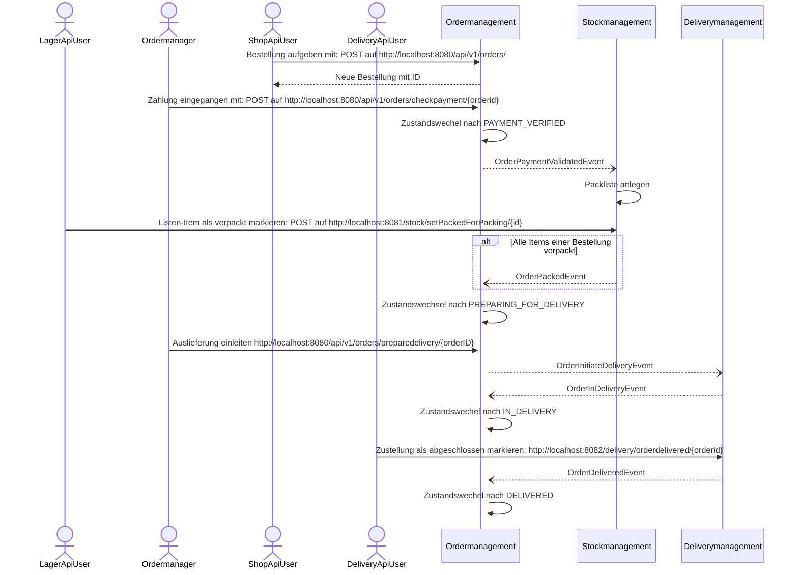

# ERPLITE Prototyp

## Einführung

ERPLITE ist eine Applikation zur Verwaltung von Bestellungen, ausgeführt als minimale, Event-getriebene **Microservice-Architektur**.

## Komponenten
Die Applikation besteht aus folgenden Komponenten:
- _Orders Microservice_ (Spring Boot Applikation nach einer Ports And Adapters-Architektur und mit Implementierung einiger taktischer DDD-Muster)
- _Stock Microservice_ (Spring Boot Applikation ohne explizite Architektur)
- _Delivery Microserver_(Spring Boot Applikation ohne explizite Architektur)
- _API Gateway_ (Spring Boot Applikation mit Spring Cloud Gateway)
- _Service Discovery_ (Spring Boot Applikation mit Netflix Eureka)
- Vanilla JavaScript Frontend in Form von 3 Seiten (Webshop, Stock, Delivery), die die MS-Infrastruktur (Backend) über das API-Gateway verwenden.

Das **Orders MS** wurde nach der **Ports-And-Adapters-Architektur** aufgebaut. Außerdem wurden dort einige taktische Muster aus dem **Domain-driven Design (DDD)** eingesetzt, darunter:

* ValueObjects
* Aggregates
* Repositories (auf Aggregat-Ebene)
* Event-getriebene Kommunikation zwischen Aggregaten

Das **Stock MS** und das Delivery MS folgen im Kontrast zum Orders MS nur einer leichtgewichtigen Schichtung ohne explizite Architektur.

Das **API Gateway** stellt den Zugriff auf die MS-Infrastruktur bereit. Es routet eingehende Anfragen auf die entsprechenden Microservices weiter und kann weitere Funktionalitäten wie Authentifizierung, Load-Balancing, Circuit-Breaker oder Retries bereitstellen.

Die **Service Discovery** registriert die beiden Microservices wenn diese gestartet werden und stellt einen Zugriff auf diese per Namen aus dem 
API-Gateway heraus bereit. Der Zugriff auf die Microservices erfolgt dementsprechend nicht mehr über IP-Adressen und Ports, sondern ähnlich einem DNS-System über einfache Namen.

## Infrastruktur (Docker-Container)
- Die Daten werden in einer Maria-DB gespeichert, wobei jedes MS seine eigene DB hat (aus Vereinfachungsgründen aktuell auf einem Server)
  - Das Orders MS benötigt eine Datenbank namens **ordermgmt**.
  - Das Stock MS benötigt eine Datenbank namens **stockmgmt**.
  - Das Delivery MS benötigt eine Datenbank namens **deliverymgmt**.
  - weitere DB-Config siehe _application.properties_
- Für die Verwaltung der DB steht PhpMyAdmin bereit.
- Die Kommunikation zwischen den Spring-Boot-Services erfolgt über den RabbitMQ Message Broker.

## Rest-APIs
Die Microservices bieten REST-Apis für verschiedene Aufgaben an. Diese APIs können über Swagger erkundet werden.

Die Swagger und OpenAPI-Docu ist erreichbar unter: http://localhost:8080/swagger/swagger-ui.html
bzw. http://localhost:8081/swagger/swagger-ui.html, http://localhost:8082/swagger/swagger-ui.html

Die Microservice-Architektur sieht vor, dass die REST-APIs "von außen" (d.h. z.B. von einem Frontend aus) nicht direkt genutzt werden,
sondern dass das API-Gateway genutzt wird, das die Anfragen dann an die jeweiligen MS weiterleitet. 

## Inbetriebnahme
### Infrastruktur-Services (Docker-Compose)
Das Docker-Compose-File für die MariaDB-Datenbank, die PHPMyAdmin und Adminer-Konsole und den RabbitMQ Message Broker sieht wie
folgt aus:

```dockerfile
version: "3.2"

services:
  rabbitmq:
    image: rabbitmq:3-management-alpine
    restart: always
    container_name: 'rabbitmq'
    ports:
        - 5672:5672
        - 15672:15672
  db:
    image: mariadb:10.3
    restart: always
    container_name: 'mariadb'
    environment:
      MARIADB_ROOT_PASSWORD: 'notSecureChangeMe'
      MARIADB_ROOT_HOST: "%"
    ports:
      - 3306:3306
    volumes:
      - ./init:/docker-entrypoint-initdb.d
  adminer:
    image: adminer:4.8.0
    container_name: 'adminer'
    restart: always
    ports:
      - 8091:8080
  phpmyadmin:
    image: phpmyadmin
    container_name: 'phpmyadmin'
    restart: always
    ports:
      - 8090:80
    environment:
      - PMA_ARBITRARY=1  
```
Im Ordner init ist folgendes Startup-SQL-Script vorhanden, das zwei User und zwei Datenbanken anlegt:
```sql
CREATE DATABASE IF NOT EXISTS `ordermgmt`;
CREATE DATABASE IF NOT EXISTS `stockmgmt`;
CREATE DATABASE IF NOT EXISTS `deliverymgmt`;
CREATE USER IF NOT EXISTS 'orderuser'@'%' IDENTIFIED BY 'newpassorder';
CREATE USER IF NOT EXISTS 'stockuser'@'%' IDENTIFIED BY 'newpassstock';
CREATE USER IF NOT EXISTS 'deliveryuser'@'%' IDENTIFIED BY 'newpassdelivery';
GRANT ALL PRIVILEGES ON *.* TO `root`@`%`;
GRANT ALL PRIVILEGES ON `ordermgmt`.* TO `orderuser`@`%`;
GRANT ALL PRIVILEGES ON `stockmgmt`.* TO `stockuser`@`%`;
GRANT ALL PRIVILEGES ON `deliverymgmt`.* TO `deliveryuser`@`%`;
```
Über _docker-compose up_ können die Infrastrukturservices gestartet werden.

PHPMyAdmin kann für die Verwaltung der Maria-DB verwendet werden:

- Browser-URL: http://localhost:8090
- Username: _root_
- Passwort: _notSecureChangeMe_
- Host: _mariadb_

Als Alternative kann auch Adminer verwendet werden:

- Browser-URL: http://localhost:8091
- Username: _root_
- Passwort: _notSecureChangeMe_
- Host: _mariadb_

Messaging wird mit RabbitMQ umgesetzt.

* Browser-Admin-Konsole: http://localhost:15672
* User: guest
* Pwd: guest

### Microservices (Spring Boot Apps)

Die fünf Microservices (Orders, Stock, Delivery, ApiGateway, ServiceDiscovery) sind gewöhnliche Spring-Boot-Applikationen und können als solche in der IDE nach Wahl geöffnet und gestartet werden.

In der Startreihenfolge ist die Service-Discovery optimalerweise Nr. 1. Danach folgen dann Orders, Stock und das API Gateway.

Ports:
- Service Discovery (Eureka): 8761
- API Gateway (Spring Cloud Gateway): 9999
- Order MS: 8080
- Stock MS: 8081
- Delivery MS: 8082

### Frontend
Das Frontend ist als Vanilla JS Prototyp (nur eine Datei) implementiert. Aufgrund der CORS-Configuration ist die Bereitstellung der Applikation über einen Webserver und den Port 5500 vorgesehen.

Das Live-Server-Plugin in Visual Studio Code verwendet eben diesen Port 5500 und stellt das Frontend dann über http://locahost:5500 bereit. Zugriffe über diesen Host werden in der aktuellen Config bezüglich CORS zugelassen.

## Beispielablauf

### Sequenzdiagramm

Das folgende Sequenzdiagramm zeigt einen Beispielablauf für einige zentrale in der APP ausimplementierten Use-Cases.



Es folgt die Beschreibung des Ablaufs mit den konkreten API-Calls (die API-Calls erfolgen über das API-Gateway auf Port 9999 und NICHT direkt über die REST-APIs der Services).

### Bestellung platzieren

Zunächst wird eine Bestellung platziert:

``` JSON
POST http://localhost:9999/api/v1/orders
Content-Type: application/json

{
  "customerID": "CUS1d34e56",
  "customerFirstname": "Caesar",
  "customerLastname": "Franklin",
  "customerEmail": "a.b@c.de",
  "customerStreet": "Hollywood Boulevard 2",
  "customerZipcode" : "3452",
  "customerCity" : "LA",
  "customerCountry" : "USA",
  "cartItems": [
    {
      "productNumber": "P123RE123D",
      "productName" : "MacBook Pro 2022",
      "priceNet" : 1000,
      "tax" : 20,
      "amount": 1
    },
    {
      "productNumber": "O12345RE12",
      "productName" : "Ipad Pro 2021",
      "priceNet" : 99.99,
      "tax" : 10,
      "amount": 10
    }
  ]
}

```

Es wird eine Bestellung angelegt, die eine neue ID bekommen hat:

``` JSON
HTTP/1.1 201
Location: http: //localhost:9999/orders/ONR8e04b1f
Content-Type: application/json
Transfer-Encoding: chunked
Date: Wed, 04 May 2022 12: 43: 53 GMT
Keep-Alive: timeout=60
Connection: keep-alive

{
    "orderID": "ONR8e04b1f",
    "customerID": "CUS1d34e56",
    "customerFirstname": "Caesar",
    "customerLastname": "Franklin",
    "customerEmail": "a.b@c.de",
    "customerStreet": "Hollywood Boulevard 2",
    "customerZipcode": "3452",
    "customerCity": "LA",
    "customerCountry": "USA",
    "orderLineItems": [
        {
        "productNumber": "P123RE123D",
        "productName": "MacBook Pro 2022",
        "priceNet": 1000.0,
        "tax": 20,
        "amount": 1
        },
        {
        "productNumber": "O12345RE12",
        "productName": "Ipad Pro 2021",
        "priceNet": 99.99,
        "tax": 10,
        "amount": 10
        }
    ],
    "state": "PLACED",
    "taxTotal": 299.99,
    "netTotal": 1999.9,
    "grossTotal": 2299.89,
    "date": "2022-05-04T14:43:53.756530"
}
```

### Bestätigung der Zahlung (händisch)

Wenn die Bestellung per (neuer) ID durchgeführt wurde, kann händisch der Zahlungseingang bestätigt werden:

``` JSON
POST http://localhost:9999/api/v1/orders/checkpayment/ONR8e04b1f
```

Daraufhin wechselt die Bestellung in den Zustand PAYMENT_VERIFIED. Die Bestelldaten können wie folgt abgerufen werden:

``` JSON
GET http://localhost:9999/api/v1/orders/ONR8e04b1f
```

### Packlisten

Das Ordermanagement sendet nach Bestätigung der Zahlung ein entsprechendes Event aus, das vom Stockmanagement empfangen
wird. Im Stockmanagement wird ein neuer Eintrag für eine Packliste erstellt.

Die Packlisten können so abgefragt werden (Achtung: der Port für das Stockmanagement ist auf **8081** gestellt):

``` JSON
GET http://localhost:9999/stock/packings
```

Das Ergebnis sind die Packlisten aus dem Stockmanagement zusammen mit ihren Listeneinträgen (zu verpackende Items):

``` JSON
HTTP/1.1 200
Content-Type: application/json
Transfer-Encoding: chunked
Date: Wed, 04 May 2022 12: 51: 48 GMT
Keep-Alive: timeout=60
Connection: keep-alive

[
    {
        "id": 4,
        "orderId": "ONR8998527",
        "deliveryData": {
        "name": "Caesar Franklin",
        "street": "Hollywood Boulevard 2",
        "zipcode": "3452",
        "city": "LA",
        "country": "USA"
        },
        "packingItemList": [
            {
            "id": 5,
            "productNumber": "P123RE123D",
            "productName": "MacBook Pro 2022",
            "amount": 1,
            "packed": false
            },
            {
            "id": 6,
            "productNumber": "O12345RE12",
            "productName": "Ipad Pro 2021",
            "amount": 10,
            "packed": false
            }
        ]
    }
]
```

Die Packings für eine bestimmte Bestellung werden so abgefragt:

``` JSON
GET http://localhost:9999/stock/packings/whithorderid/ONR8998527
```

Die Packings können auch nach Packing-ID abgefragt werden:

``` JSON
GET http://localhost:9999/stock/packings/1
```

### Packlisten-Items als verpackt markieren

Die einzelnen Items der Packlisten können per ID als verpackt markiert werden:

``` JSON
POST http://localhost:9999/stock/setPackedForPacking/2
POST http://localhost:9999/stock/setPackedForPacking/3
```

### Bestellung für Versand vorbereiten

Wenn im Stockmanagement alle Items einer Packliste verpackt sind, wird ein Event ausgelöst, das das Ordermanagement
empfängt und daraufhin den Zustand der Bestellung in PREPARING_FOR_DELIVERY ändert.

Die Bestellung kann wieder abgefragt werden:

``` JSON
GET http://localhost:9999/api/v1/orders/ONR8998527
```

Das Ergebnis ist die Bestellung, die nun den neuen Zustand aufweist.

``` JSON
HTTP/1.1 200
Content-Type: application/json
Transfer-Encoding: chunked
Date: Wed, 04 May 2022 13:27:58 GMT
Keep-Alive: timeout=60
Connection: keep-alive

{
  "orderID": "ONR8998527",
  "customerID": "CUS1d34e56",
  "customerFirstname": "Caesar",
  "customerLastname": "Franklin",
  "customerEmail": "a.b@c.de",
  "customerStreet": "Hollywood Boulevard 2",
  "customerZipcode": "3452",
  "customerCity": "LA",
  "customerCountry": "USA",
  "orderLineItems": [
    {
    "productNumber": "P123RE123D",
    "productName": "MacBook Pro 2022",
    "priceNet": 1000.0,
    "tax": 20,
    "amount": 1
    },
    {
    "productNumber": "O12345RE12",
    "productName": "Ipad Pro 2021",
    "priceNet": 99.99,
    "tax": 10,
    "amount": 10
    }
  ],
  "state": "PREPARING_FOR_DELIVERY",
  "taxTotal": 299.99,
  "netTotal": 1999.9,
  "grossTotal": 2299.89,
  "date": "2022-05-04T14:51:31.068842"
}
```
### Auslieferung initiieren
Per API-Call kann für eine Bestellung im Status _PREPARING_FOR_DELIVERY_ eine Auslieferung im Delivery-Service initiiert werden.

``` JSON
POST http://localhost:8080/api/v1/orders/preparedelivery/{orderID}
```

Das Order MS sendet daraufhin ein Event _OrderInitiateDeliveryEvent_ aus.

Dieses Event wird vom Delivery MS empfangen. Das Delivery MS legt einen Eintrag für die Auslieferung in der eigenen DB an und sendet dann ein _OrderInDeliveryEvent_ aus.

Das Order MS empfängt dieses Event und setzt den Status der Bestellung auf _IN DELIVERY_.

### Auslieferung abgeschlossen

Über einen REST-API-Call auf 

``` JSON
POST http://localhost:9999/delivery/orderdelivered/{orderid}
```

kann die Bestellung im Delivery MS als zugestellt bekannt gegeben werden.

Daraufhin sendet das Delivery MS ein letztes Event _OrderDeliveredEvent_ das vom Order MS konsumiert wird, woraufhin die Bestellung auf _DELIVERED_ gesetzt wird.